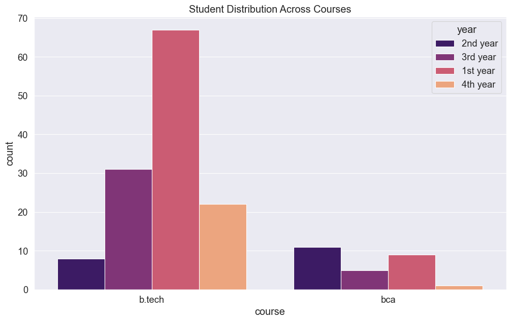
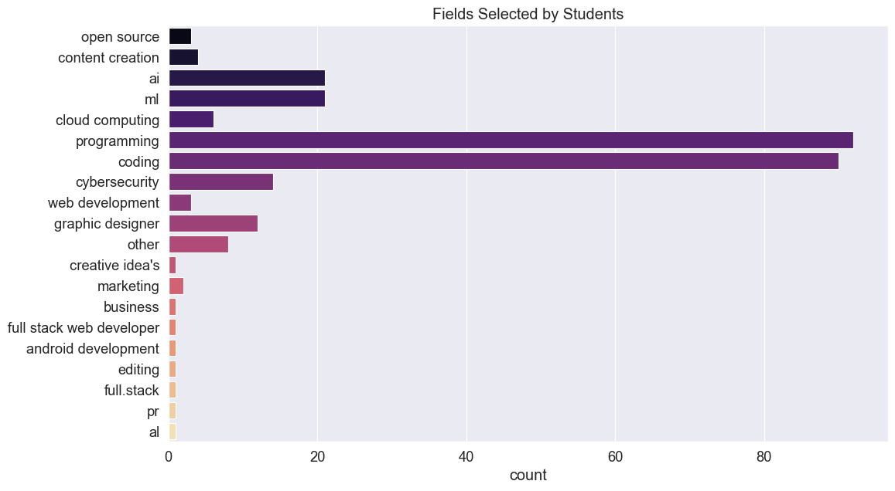
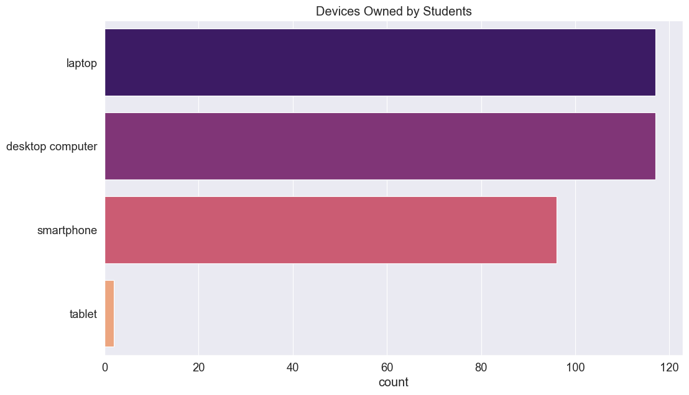
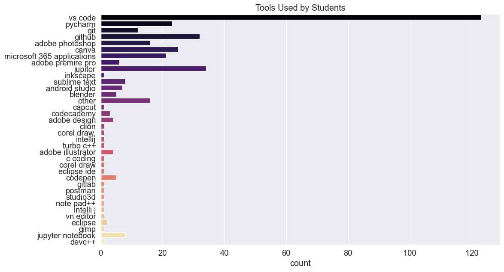
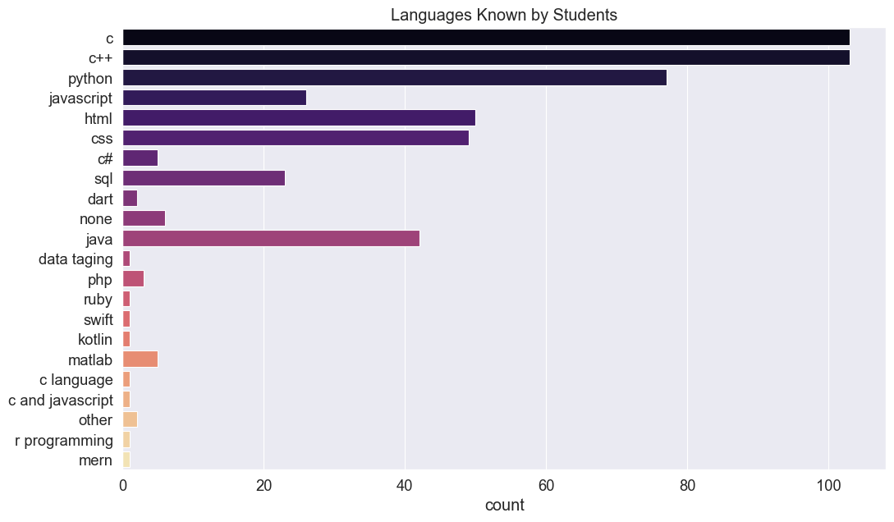
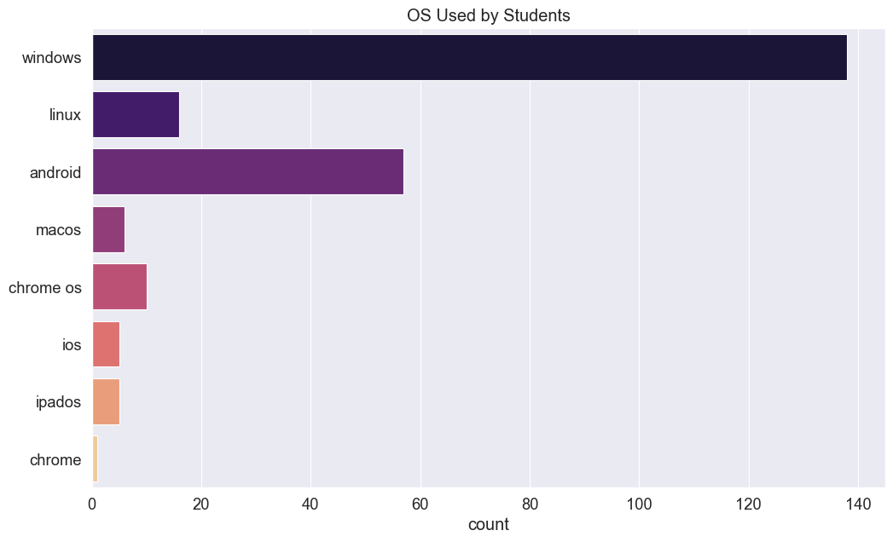
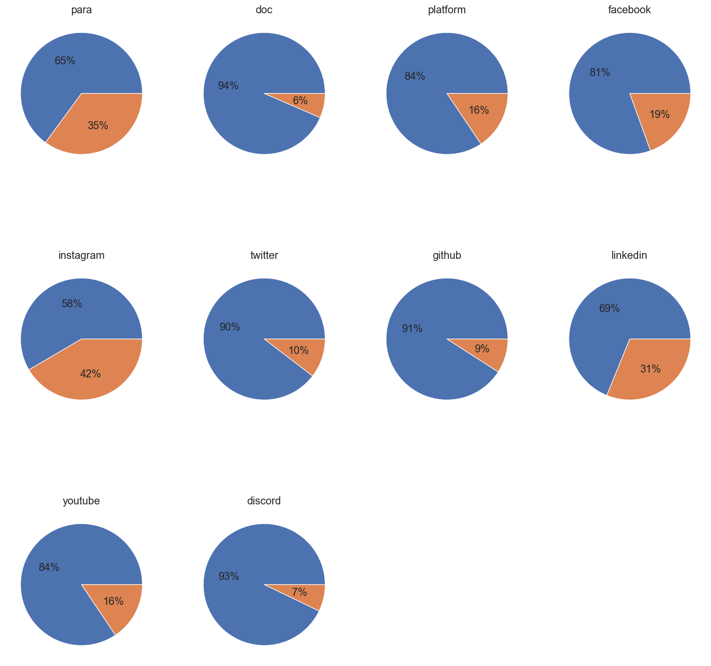
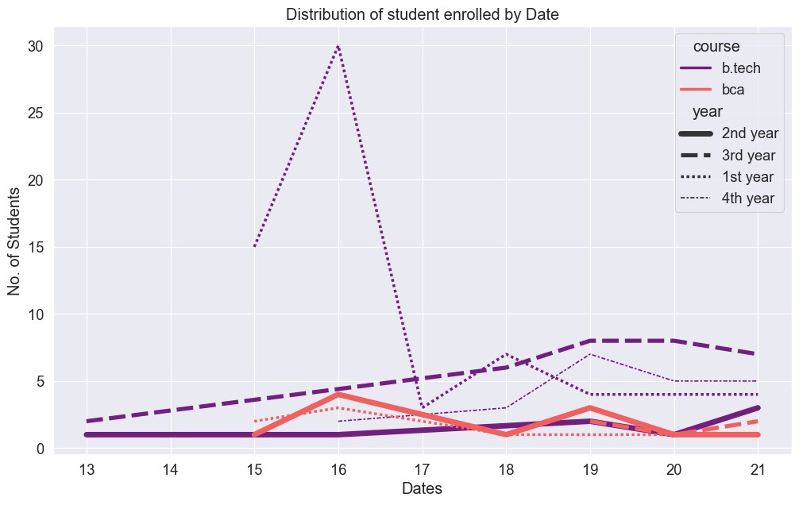
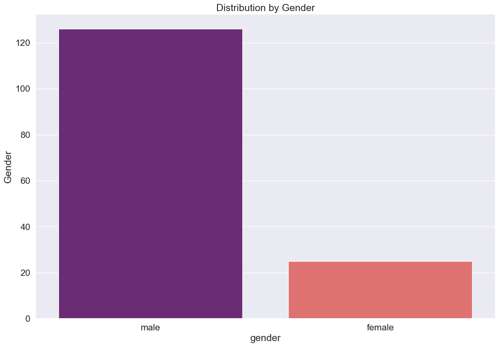
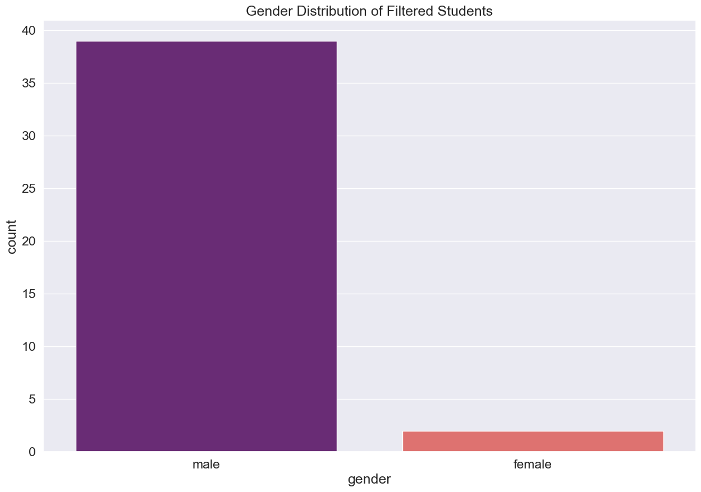

# Smart Bugs Entry Form Analysis

## Imports


```python
import pandas as pd
import matplotlib.pylab as plt
import seaborn as sns
```

_Some default settings for the plots and dataframe. They are not important but make the output more presentable_


```python
plt.style.use('ggplot')
sns.set_palette('cool')
sns.set(rc={"figure.figsize":(12, 7)})
sns.set_context("paper", font_scale=1.5, rc={"lines.linewidth": 2.5})
pd.set_option('display.max_columns', 200)
```

## Data Preprocessing

Like any form data this dataset is also very dirty and messy. We will need to do some significant preprocessing before we can analyse our data.


```python
data = pd.read_csv('club-registration.csv')
```

The data has a lot of missing values, really long column names and inconsistent data formatting. Don't worry we will fix all of it.

### 1. Column Renaming
First we will start with renaming out columns. Some rules of thumb for columns names.
- A column name must have two to three words max.
- All letters must be in small case.
- And there should be no spaces in subsequent words.


```python
data_renamed = data.rename(columns={
    'Timestamp':'time', 
    'Your Name':'name', 
    'Course': 'course', 
    'Branch': 'branch', 
    'College Roll no.': 'rollno',
    'Phone Number': 'phone', 
    'WhatsApp Number': 'chat', 
    'Current Year': 'year',
    'Please select the field(s) that you are interested in joining:': 'field',
    'If you selected Other in field then, Please Specify your other field':'other_field',
    'Attach any previous experience or skills certification relevant to the filed(s) you are interested in joining:':'doc',
    'Explain, why you are interested in joining the selected field(s) and what you hope to gain from the experience':'para',
    'Please let us know if you have any other queries:':'query',
    'Which Device(s) do you mostly use:':'devices',
    'Please provide a link to the platform/website where you practice and are most active: ':'platform',
    'Which tools are you familiar with?':'tools', 
    'Please specify your other tool:':'other_tools',
    'Which coding language(s) are you proficient in or primarily use:':'language',
    'Please Specify your Other coding language(s):':'other_language',
    'Which operating system are you familiar with?':'os',
    'Please Specify your other operating system:':'other_os', 
    'Facebook':'facebook', 
    'Instagram':'instagram',
    'Twitter':'twitter', 
    'Github':'github', 
    'LinkedIn':'linkedin', 
    'YouTube':'youtube', 
    'Discord':'discord',
    'Provide your Personal E-mail':'email',
    'Do you have any expertise or specialized knowledge in any specific tech area? If yes, please describe briefly: ':'expertise',
    'Email Address':'email_address', 
    'Please provide us your social media (if you use)':'social_media'
})

data_renamed.columns.to_list()
```


    ['time',
     'name',
     'course',
     'branch',
     'rollno',
     'phone',
     'chat',
     'year',
     'field',
     'other_field',
     'doc',
     'para',
     'query',
     'devices',
     'platform',
     'tools',
     'other_tools',
     'language',
     'other_language',
     'os',
     'other_os',
     'facebook',
     'instagram',
     'twitter',
     'github',
     'linkedin',
     'youtube',
     'discord',
     'email',
     'expertise',
     'email_address',
     'social_media']


### 2. Dropping unnessary columns
Here we will drop any columns that we do not need for our analysis.


```python
data_imp = data_renamed[[
    'time', 
    'name', 
    'course', 
    'branch', 
    'rollno', 
    #'phone', 
    'chat', 
    'year',
    'field', 
    'other_field', 
    'doc', 
    'para', 
    #'query', 
    'devices', 
    'platform',
    'tools', 
    'other_tools', 
    'language', 
    'other_language', 
    'os', 
    'other_os',
    'facebook', 
    'instagram', 
    'twitter', 
    'github', 
    'linkedin', 
    'youtube',
    'discord', 
    #'email', 
    'expertise', 
    #'email_address', 
    #'social_media'
]]
data_imp.shape
```


    (154, 27)


### 3. Parsing Data
The data has some inconsistencies in it. This is were we deal with it.


```python
data_parsed = data_imp.copy()
```

#### 3.1. Parsing Date and Time
The time column which is a timestamp of the form entry is in the string format. We will need to change it to datetime format to work effectively with it.


```python
data_parsed['time'] = pd.to_datetime(data_parsed['time'])
```

#### 3.2. Removing trailing spaces and lowercase everything.
The data has some inconsistencies related to spacing and capitalisation so we will remove any extra spaces and lower case everything.


```python
def remove_spaces(col):
    if col.name != 'time':
        col = col.str.strip()
        col = col.str.lower()
    return col

data_no_spaces = data_parsed.apply(remove_spaces)
```

#### 3.3. Fill all NaN's and funky values
Since the data is filled by real humans, it has some missing and weird entries. So we will take care of them.


```python
# A list of funky values with columns
funky_vals = {
    'time': [],
    'doc': [],
    'name': [],
    'course': [], 
    'branch': [], 
    'rollno': ['satyug darshan institute engineering and technology'], 
    'chat': [], # 'same as above'
    'year': [], 
    'field': [],
    'other_field': ['i am confuse', 'no'],
    'devices': [],
    'tools': [], 
    'other_tools': [], 
    'language': [],
    'other_language': ['i only know c language but i am learning puthon too', 'no, other'],
    'os': [],
    'other_os': ['only window'],
    'platform': ["i'm not", 'whatsapp', 'https://www.instagram.com/reel/cpwdkijaa30/?igshid=mzrlodbinwflza=='],
    'facebook': ['no', 'yes'],
    'instagram': ['yes', 'no'],
    'twitter': ['yes', 'no'],
    'github': ['no', 'yes'],
    'linkedin': ['yes', 'no'],
    'youtube': ['yes'],
    'discord': ['no'],
    'para': [],
    'expertise': ['no', 'little bit', 'not so much that i will tell you', 'sorry currently no but soon']
}
```


```python
data_no_nans = data_no_spaces.fillna(False)
```


```python
def fill_the_funk(col):
    for i in range(len(col)):
        if col[i] in funky_vals[col.name]:
            col[i] = False
    return col

data_no_funks = data_no_nans.apply(fill_the_funk, axis=0)
```

### 4. Encoding values
For our analysis purposes we will binary encode the columns which has any links and paragraphs.


```python
encode_cols = ['para', 'doc', 'platform', 'facebook', 'instagram', 'twitter', 'github', 'linkedin', 'youtube', 'discord', 'expertise']
```


```python
def encode_vals(col):
    for i in range(len(col)):
        if col[i] != False:
            col[i] = True
    return col

data_encoded = data_no_funks[encode_cols].apply(encode_vals, axis=0)
data_encoded = data_no_funks.drop(columns=encode_cols).join(data_encoded)
```


```python
data_encoded[encode_cols].head(4)
```


<div>
<style scoped>
    .dataframe tbody tr th:only-of-type {
        vertical-align: middle;
    }

    .dataframe tbody tr th {
        vertical-align: top;
    }

    .dataframe thead th {
        text-align: right;
    }
</style>
<table border="1" class="dataframe">
  <thead>
    <tr style="text-align: right;">
      <th></th>
      <th>para</th>
      <th>doc</th>
      <th>platform</th>
      <th>facebook</th>
      <th>instagram</th>
      <th>twitter</th>
      <th>github</th>
      <th>linkedin</th>
      <th>youtube</th>
      <th>discord</th>
      <th>expertise</th>
    </tr>
  </thead>
  <tbody>
    <tr>
      <th>0</th>
      <td>False</td>
      <td>False</td>
      <td>False</td>
      <td>False</td>
      <td>False</td>
      <td>False</td>
      <td>False</td>
      <td>False</td>
      <td>False</td>
      <td>False</td>
      <td>False</td>
    </tr>
    <tr>
      <th>1</th>
      <td>True</td>
      <td>False</td>
      <td>True</td>
      <td>True</td>
      <td>True</td>
      <td>True</td>
      <td>True</td>
      <td>True</td>
      <td>True</td>
      <td>True</td>
      <td>False</td>
    </tr>
    <tr>
      <th>2</th>
      <td>True</td>
      <td>True</td>
      <td>True</td>
      <td>False</td>
      <td>False</td>
      <td>False</td>
      <td>True</td>
      <td>True</td>
      <td>False</td>
      <td>True</td>
      <td>True</td>
    </tr>
    <tr>
      <th>3</th>
      <td>True</td>
      <td>False</td>
      <td>False</td>
      <td>False</td>
      <td>False</td>
      <td>False</td>
      <td>False</td>
      <td>False</td>
      <td>False</td>
      <td>False</td>
      <td>False</td>
    </tr>
  </tbody>
</table>
</div>


### 5. Combining `Vals` and `Other_Vals`
The data also has some columns of format `vals` and `other_vals`, we will need to merge these columns to reduce the overhead.


```python
combine_cols = {
    'tools': 'other_tools',
    'language': 'other_language',
    'field': 'other_field',
    'os': 'other_os'
}
```


```python
def combine_vals(row):
    for col in combine_cols.keys():
        other_col = combine_cols[col]
        if row[other_col] != False:
            row[col] += ',' + row[other_col]
    return row

data_combined = data_encoded.apply(combine_vals, axis=1).drop(columns=combine_cols.values())
```


```python
data_combined[combine_cols.keys()].head(4)
```


<div>
<style scoped>
    .dataframe tbody tr th:only-of-type {
        vertical-align: middle;
    }

    .dataframe tbody tr th {
        vertical-align: top;
    }

    .dataframe thead th {
        text-align: right;
    }
</style>
<table border="1" class="dataframe">
  <thead>
    <tr style="text-align: right;">
      <th></th>
      <th>tools</th>
      <th>language</th>
      <th>field</th>
      <th>os</th>
    </tr>
  </thead>
  <tbody>
    <tr>
      <th>0</th>
      <td>vs code, pycharm</td>
      <td>c/c++</td>
      <td>open source</td>
      <td>windows</td>
    </tr>
    <tr>
      <th>1</th>
      <td>vs code, git, github, pycharm, adobe photoshop...</td>
      <td>python, javascript, c/c++, html/css</td>
      <td>content creation</td>
      <td>windows, linux, androide</td>
    </tr>
    <tr>
      <th>2</th>
      <td>vs code, git, github, jupitor, canva, inkscape</td>
      <td>python, javascript, c/c++, html/css, c#, sql, ...</td>
      <td>ai/ml</td>
      <td>windows, linux</td>
    </tr>
    <tr>
      <th>3</th>
      <td>vs code, pycharm, jupitor</td>
      <td>none</td>
      <td>ai/ml</td>
      <td>windows, androide</td>
    </tr>
  </tbody>
</table>
</div>


### 6. Spliting strings
Some entries such that tools and languages have multiple values but they are grouped together as a comma `,` and slash `/` separated string. So we will need to open this encoding to use these the values efficiently.


```python
data_split = data_combined.copy()
split_cols = ['tools', 'language', 'field', 'os', 'devices']

def decode_strings(col):
    return col.str.split(',|/')

def strip_cols(col):
    for i in range(len(col)):
        elems = []
        for elem in col[i]:
            elems.append(elem.strip())
        col[i] = elems
    return col

def rid_the_funk(col):
    if col.name == 'os':
        for j in range(len(col)):
            val = col[j]
            for i in range(len(val)):
                if val[i] == 'androide':
                    val[i] = 'android'
            col[j] = val
    return col
    
data_split[split_cols] = data_split[split_cols].apply(decode_strings)
data_split[split_cols] = data_split[split_cols].apply(strip_cols)
data_split[split_cols] = data_split[split_cols].apply(rid_the_funk)
```

# Exploratory Data Analysis (EDA)


```python
fig = sns.countplot(x='course', hue='year', data=data_split, palette='magma')
fig.set_title('Student Distribution Across Courses');
```


    

    


```python
fig = sns.countplot(y=data_split.field.sum(), palette='magma')
fig.set_title('Fields Selected by Students');
```


    

    


```python
fig = sns.countplot(y=data_split.devices.sum(), palette='magma');
fig.set_title('Devices Owned by Students');
```


    

    


```python
fig = sns.countplot(y=data_split.tools.sum(), palette='magma');
fig.set_title('Tools Used by Students');
```


    

    


```python
fig = sns.countplot(y=data_split.language.sum(), palette='magma');
fig.set_title('Languages Known by Students');
```


    

    


```python
fig = sns.countplot(y=data_split.os.sum(), palette='magma');
fig.set_title('OS Used by Students');
```


    

    


```python
fig, ax = plt.subplots(3, 4, figsize=(17, 17))
c = 0
fig.delaxes(ax[2][2])
fig.delaxes(ax[2][3])

for i in range(3):
    for j in range(4):
        col_name = encode_cols[c]
        ax[i, j].pie(data_split[col_name].value_counts(), autopct='%.0f%%')
        ax[i, j].title.set_text(col_name)
        c+=1
        if c >= 10:
            break
        
```


    

    


```python
time_series_df = data_split.groupby([data_split.time.dt.day, 'course', 'year']).name.count()
time_series_df = pd.DataFrame(time_series_df)
fig = sns.lineplot(data=time_series_df, x='time', y='name', hue='course', size='year', style='year', palette='magma')
fig.set_xlabel('Dates');
fig.set_ylabel('No. of Students');
fig.set_title('Distribution of student enrolled by Date');
```


    

    


# Distribution of students by Gender
The dataset does not contain the gender of the student, so we will use a gender API to get the gender of students by their names.


```python
import requests
```


```python
def get_gender(name):
    URL = "https://api.genderize.io/"
    PARAMS = {'name':name, 'country_id':'IN'}
    r = requests.get(url = URL, params = PARAMS)
    data = r.json()
    return data['gender']
```


```python
def genderize(val):
    first_name = val[0]
    gender = get_gender(first_name)
    return gender
```

_The API is slow, so don't run this run often_


```python
genders = data_split.name.str.split(' ').map(genderize)
genders
```


    0        male
    1        male
    2        male
    3        male
    4        None
            ...  
    149      male
    150      male
    151    female
    152    female
    153      male
    Name: name, Length: 154, dtype: object


```python
genders.name = 'gender'
data_with_gender = data_split.join(genders)
```

_The API is not able to genderize these names so I will do them manually._


```python
un_genderized = data_with_gender[data_with_gender.gender.isnull()]
```


```python
data_with_gender.loc[4, 'gender'] = 'female'
data_with_gender.loc[22, 'gender'] = 'male'
data_with_gender.loc[137, 'gender'] = 'male'
```


```python
fig = sns.countplot(x=genders, palette='magma')
fig.set_title('Distribution by Gender');
fig.set_ylabel('Gender');
```


    

    


# Selecting Students based on a Heuristics
The task here is to come up with a heuristics to score a student based on his/her entries and apply it to the dataset.


```python
# Heuristics
heuristic = {
    #col: points
    'name': 1,
    'course': 1,
    'branch': 1,
    'rollno': 1,
    'chat': 1,
    'year': 1,
    'field': 1,
    'devices': 1,
    #tools: length of tools,
    'language': 1,
    'os': 1,
    'para': 3,
    'doc': 5,
    'platform': 1,
    'facebook': 1,
    'instagram': 1,
    'twitter': 1,
    'github': 3,
    'linkedin': 2,
    'youtube': 1,
    'discord': 4,
    'expertise': 3,
    'gender': 0,
}
```

_Scoring the dataset_


```python
score_df = data_with_gender.copy()
def score_students(col):
    if col.name == 'tools':
        for i in range(len(col)):
            col[i] = len(col[i])
    else:
        score = heuristic[col.name]
        for i in range(len(col)):
            if col[i]:
                col[i] = score
            else:
                col[i] = 0
    return col

scored_df = score_df.drop(columns='time').apply(score_students)
```

_Sort the dataset based on scoring_


```python
final_scoring = scored_df.sum(axis=1).sort_values(ascending=False)
```


```python
data_with_all_details = data_renamed.join(genders)
```

_Threshold the points and getting the names of students_


```python
threshold = 18
students_selected = final_scoring[final_scoring.gt(threshold)]
print('Number of Students after filtering: ', len(students_selected))
student_details = data_with_all_details.iloc[students_selected.index]
```

    Number of Students after filtering:  42
    


```python
name_series = data_with_all_details.loc[students_selected.index].name
name_series.index = students_selected.values
```

_Distribution of filtered students based on gender_


```python
fig = sns.countplot(x=student_details.gender, palette='magma')
fig.set_title('Gender Distribution of Filtered Students');
```


    

    


### Scoring of all girl students
Since the dataset is highly skewed, I just calculated the scoring of female students separately to see if there are any potential candidates there as well. <br>
`Gender does not affect the way students are scored or there selection`


```python
only_girls = data_with_gender.query("gender == 'female'").reset_index().drop(columns=['time', 'index'])
girl_scoring =  only_girls.copy().apply(score_students).sum(axis=1).sort_values(ascending=False)
```


```python
name_series = only_girls.loc[girl_scoring.index].name
name_series.index = girl_scoring.values
```

_Saving the details to a csv file_


```python
student_details.to_csv('filtered.csv')
```
